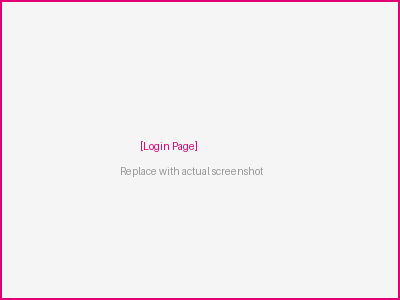
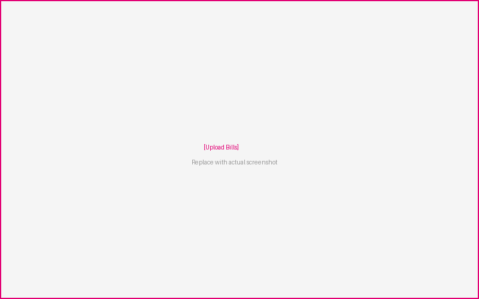
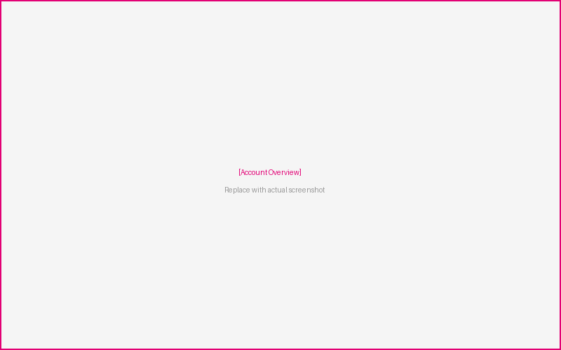
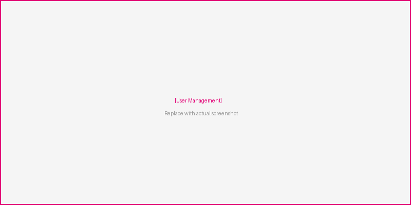

# T-Mobile Bill Analytics Dashboard

A Streamlit-powered analytics dashboard for T-Mobile monthly bills. Upload PDF bills and explore spending trends, per-line charges, savings, and more — with Google OAuth authentication and cloud-hosted MotherDuck database.

## Screenshots

### Login
Secure Google OAuth sign-in — only authorized users can access the dashboard.



### Upload Bills
Upload T-Mobile PDF bills. Parsed data is stored in MotherDuck (cloud) or local DuckDB.



### Account Overview
KPIs at a glance: total spent, average bill, savings, active lines, and monthly trend chart.



### User Management (Admin)
Manage authorized users — add viewers, remove access, permanent admin protection.



## Features

### 📋 Core
- **Upload Bills** — Upload monthly T-Mobile bill PDFs directly in the app
- **Account Overview** — KPIs, bill composition, line counts, and monthly bar chart
- **Monthly Trends** — Track any metric over time with MoM change
- **Bill Splitup** — Per-person monthly cost breakdown with account charge distribution (Voice lines only)

### 📊 Analytics
- **Line Analysis** — Per-line lifecycle, charge breakdown, and heatmap
- **Line Cost by Month** — Filterable month-over-month cost per phone line
- **Usage Details** — Talk minutes, data usage per line
- **Person View** — Aggregated cost per person across all lines

### 📑 Reports
- **Savings & Discounts** — AutoPay, service, and device discount tracking
- **Raw Data Explorer** — Run arbitrary SQL against the DuckDB database

### ⚙️ Admin
- **User Management** — Google OAuth user access control with admin/viewer roles
- **Phone Directory** — Map phone numbers to person names via UI

## Quick Start (Local)

```bash
# Clone the repo
git clone https://github.com/babuganesh2000/tmobile-bill-analytics.git
cd tmobile-bill-analytics

# Create virtual environment & install deps
python -m venv .venv
.venv\Scripts\activate        # Windows
pip install -r requirements.txt

# Run the app
streamlit run app.py
```

Open http://localhost:8501 and navigate to **Upload Bills** to add your PDFs.

## Deploy to Streamlit Community Cloud

1. Push this repo to GitHub (already done if you forked it)
2. Go to [share.streamlit.io](https://share.streamlit.io)
3. Click **New app** → select this repo → set main file to `app.py`
4. Deploy!

The app ships with a pre-loaded seed database (`data/tmobile_bills.duckdb`) so the dashboard works immediately. Upload additional PDFs through the UI.

## Project Structure

```
├── app.py                    # Streamlit dashboard (main entry point)
├── parser.py                 # Shared PDF parser & DuckDB loader module
├── load_bills.py             # CLI tool for batch-loading PDFs
├── export_xlsx.py            # Export DB to formatted Excel workbook
├── redact_screenshots.py     # Blur/grey personal info in screenshots
├── data/
│   └── tmobile_bills.duckdb  # Seed database (empty for cloud deploy)
├── screenshots/              # App screenshots (redacted)
│   ├── 01_login.png
│   ├── 02_upload.png
│   ├── 03_overview.png
│   └── 04_user_management.png
├── requirements.txt
├── .streamlit/
│   ├── config.toml           # Theme & server config
│   └── secrets.toml          # Google OAuth + MotherDuck token (gitignored)
└── README.md
```

## Tech Stack

- **Streamlit** — Web UI
- **Plotly** — Interactive charts
- **DuckDB + MotherDuck** — Embedded / cloud analytical database
- **pdfplumber** — PDF text extraction
- **Pandas** — Data manipulation
- **Google OAuth 2.0** — Authentication

## CLI Usage

For bulk-loading PDFs from a local directory:

```bash
python load_bills.py          # Loads all PDFs in current directory
```

## License

Private — personal use only.
